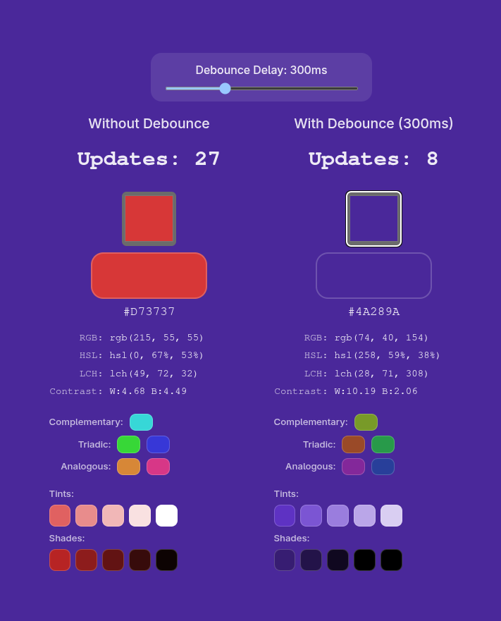

<div align="center">
    <h4>Color Input Debounce Demo</h4>
    
    <p>Interactive demonstration comparing color input performance with and without debounce.</p>
</div>


## Overview

Two color inputs side-by-side: one updates state immediately, the other uses debounce. Each input performs heavy computations on every change:

- Color space conversions (RGB, HSL, LCH)
- Palette generation (complementary, triadic, analogous)
- Color variations (tints, shades, tones)
- Contrast ratio calculations
- Background color updates

The update counter shows the performance difference: non-debounced triggers on every change, debounced batches updates.

## Live Demo

http://metaory.github.io/color-input-debounce-demo/

## Tech Stack

- React 19
- Vite
- Vanilla JavaScript

## Development

```bash
npm install
npm run dev
```

## Build

```bash
npm run build
```

## License

[MIT](LICENSE)